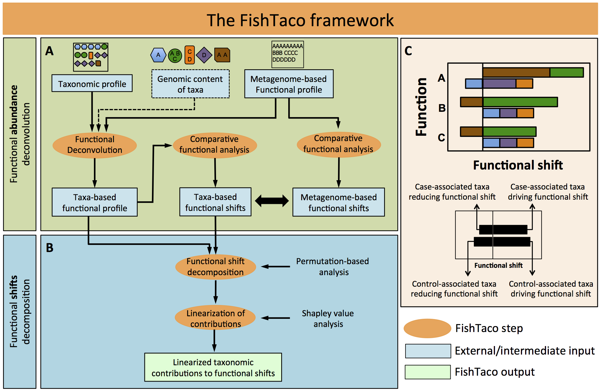

.. FishTaco documentation master file, created by
   sphinx-quickstart on Mon Jan 26 15:16:56 2015.
   You can adapt this file completely to your liking, but it should at least
   contain the root `toctree` directive.

FishTaco: Functional Shift Taxonomic Contributors
=================================================
.. index:: Home

FishTaco is a metagenomic computational framework, aiming to identify the taxa that are driving the functional shifts
we observe in microbiomes of different individuals or disease states.

Table of contents
=================

.. toctree::
   :maxdepth: 2

   index
   installation
   execution
   visualization

Citing Information
==================

If you use the FishTaco software, please cite the following paper:

**Linking taxonomic and functional metagenomic profiles to identify species driving functional shifts in the human microbiome.**
Ohad Manor and Elhanan Borenstein. *In preparation*

Question forum
==============
For FishTaco announcements and questions, including notification of new releases, you can visit the `FishTaco users forum <https://groups.google.com/forum/#!forum/fishtaco-users>`_.

