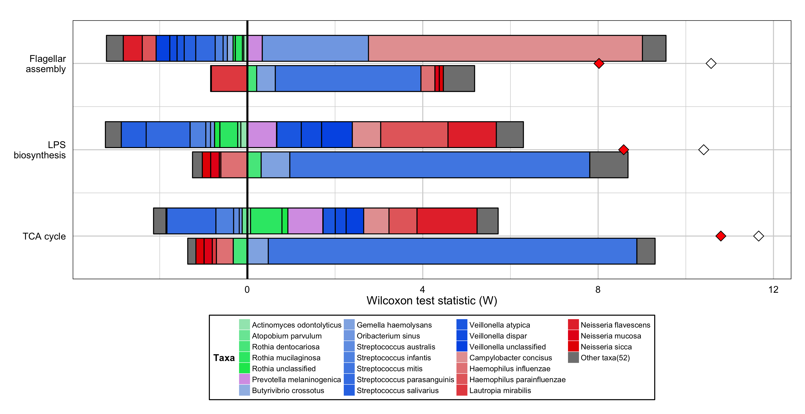
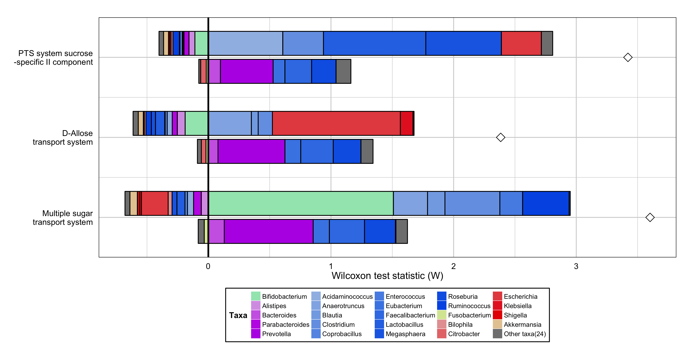

FishTaco Visualization
===============================

All the figures shown in the FishTaco paper are produced in R (http://www.r-project.org/) by using the FishTacoPlot package.

FishTacoPlot package
--------------------

Plotting the results obtained from applying FishTaco to you data is done in R. We used R to take full advantage of the capabilities of
the `ggplot2 package <http://ggplot2.org/>`_. We recommend downloading and installing `R Studio <http://www.rstudio.com/>`_ before plotting, but
it is not required.

1. Download the FishTacoPlot package from the `FishTaco GitHub page <https://github.com/omanor/fishtaco>`_.

2. Install the package in your R terminal with the command:
``install.packages(path_to_package, repos = NULL, type="source")``

3. Load the package to your workspace with the command: ``require(FishTacoPlot)``

4. Plot your results, for example by using:

.. code:: python

    MultiFunctionTaxaContributionPlots(input_dir=FISHTACO_OUTPUT_DIR, input_prefix="pathway", input_score="wilcoxon", input_taxa_taxonomy=TAXONOMY_FILE,
    min_shift_explained=0, sort_by="list", show_only_enriched_functions=TRUE, plot_type="bars", separate_enriched_depleted_taxa=TRUE,
    show_only_diff_abun_taxa=TRUE, input_function_filter_list=c("ko00020", "ko00540","ko02040" ), add_predicted_da_markers=TRUE,
    add_original_da_markers=TRUE)

Examples
--------

Metagenomic Comparative Analysis of Different Body Sites
^^^^^^^^^^^^^^^^^^^^^^^^^^^^^^^^^^^^^^^^^^^^^^^^^^^^^^^^

An example of a FishTaco plot showing the species-level contributions to the functional enrichment of 3 pathways in tongue samples compared to
mucosa samples:

Metagenomic Comparative Analysis of a Disease Cohort
^^^^^^^^^^^^^^^^^^^^^^^^^^^^^^^^^^^^^^^^^^^^^^^^^^^^

An example of a FishTaco plot showing the genus-level contributions to the functional enrichment of 3 modules in type 2 diabetes patients compared to
healthy controls:

